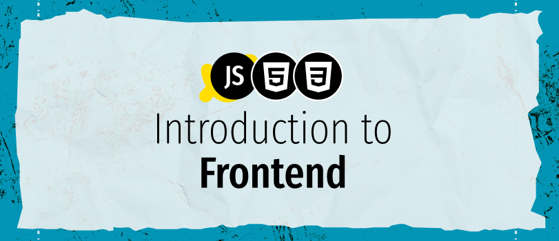
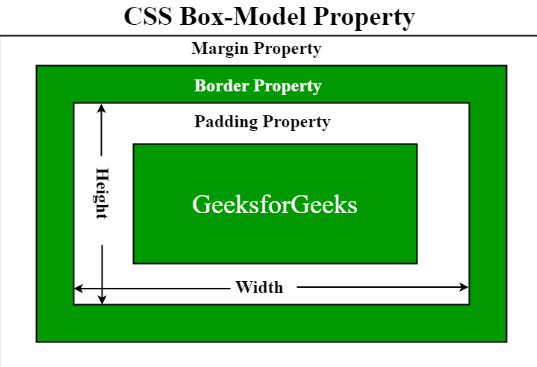
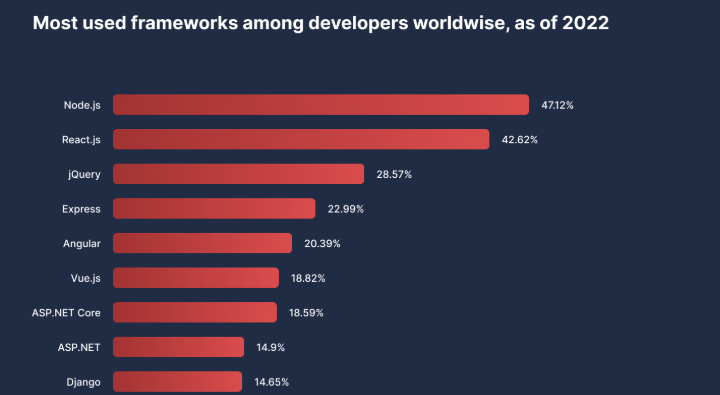
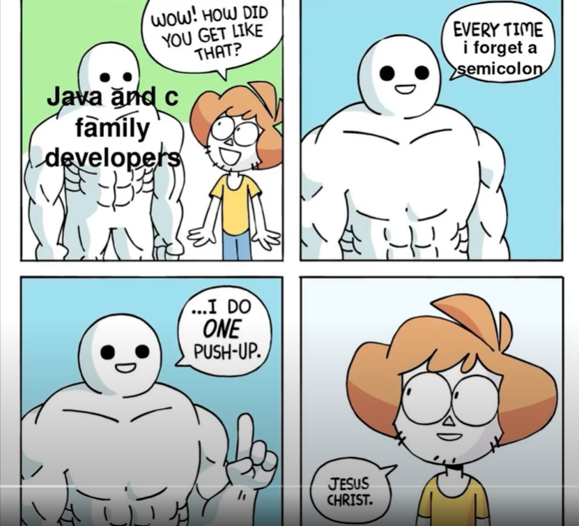
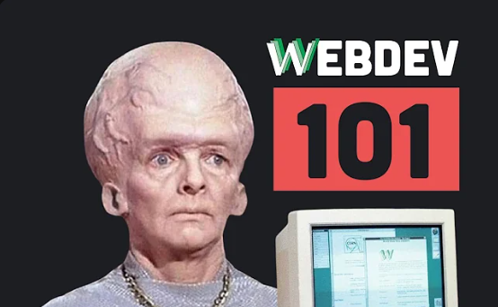

# **Introduction to Frontend Development**

## **1. What is Frontend Development?**
Frontend development is creating the part of a website or app that users interact with. This includes everything you see and interact with on a website, like buttons, images, and text.

## **2. Key Concepts in Frontend Development**

Frontend development has three main building blocks:

- **HTML (HyperText Markup Language)**: The structure of a webpage.
- **CSS (Cascading Style Sheets)**: Styles that make the webpage look nice.
- **JavaScript**: Adds interactive elements to make a page dynamic.

## **3. Frontend Development Basics**

### **HTML**
- **HTML Basics**: Tags, elements, and attributes create the page structure.
- **Semantic HTML**: Using tags like `<header>`, `<footer>`, `<section>` for better readability and SEO.

### **CSS**
- **CSS Basics**: Used to style HTML elements with properties like colors and fonts.
- **Box Model**: Understand the spacing of elements (margin, border, padding).
- **Layouts**: Flexbox and Grid are useful for making responsive (mobile-friendly) layouts.

### **JavaScript**
- **JavaScript Basics**: Adds logic, like showing a popup when a button is clicked.
- **DOM Manipulation**: Lets you change the HTML structure using JavaScript.
- **ES6+ Features**: Modern features like arrow functions and classes make JavaScript easier to write.

## **4. Popular Tools in Frontend Development**

### **Frameworks and Libraries**

- **React**: Helps build user interfaces more easily.
- **Vue.js**: A simple framework for building interactive web applications.
- **Angular**: A powerful framework for building complex apps.

- _or you could use C language, if you don't like being free time (this is a joke)_

### **Text Editors**
- **VS Code**: One of the most popular code editors.
- **Atom**: User-friendly and customizable.

### **Version Control with Git**
- **Git** and **GitHub**: Used to track code changes and collaborate with others.

## **5. Making Websites Responsive**

- **Responsive Design**: Ensures a website looks good on all devices (like phones and tablets).
- **Media Queries**: Allow you to apply different styles for different screen sizes.

## **6. Web Accessibility Basics**

Making sure a website is usable for everyone, including people with disabilities, is essential:

- **Semantic HTML**: Helps screen readers understand the structure.

## **7. Resources for Learning Frontend Development**

- **Documentation**: [Mozilla Developer Network (MDN) Web Docs](https://developer.mozilla.org/), W3Schools
- **Online Courses**: FreeCodeCamp, Codecademy
- **Communities**: Stack Overflow, Dev.to

---

This guide provides the basics of frontend development and a roadmap to start learning and building projects.